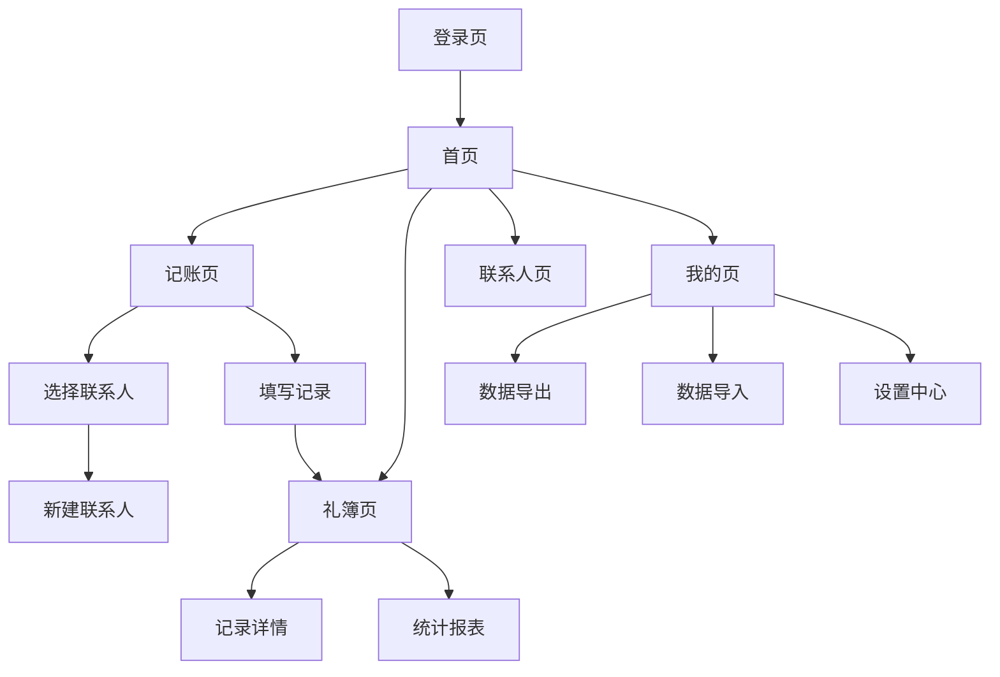

## 1. 产品概述
人情份子钱记录应用是一个专门用于管理人情往来礼金的移动优先应用。用户可以轻松记录送礼和收礼信息，管理联系人关系，实现个人财务的透明化管理。

该应用解决传统纸质记账易丢失、难查询、不便统计的问题，为用户提供便捷的人情往来管理工具，特别适合需要频繁参与婚礼、满月酒、寿宴等场合的用户群体。

## 2. 核心功能

### 2.1 用户角色
| 角色 | 注册方式 | 核心权限 |
|------|----------|----------|
| 普通用户 | 手机号注册/邮箱注册 | 管理个人礼簿、联系人、数据导入导出 |
| 高级用户 | 应用内购买升级 | 数据备份、高级报表、多人协作 |

### 2.2 功能模块
应用包含以下核心页面：
1. **首页**：礼簿概览、快速记账入口、最近记录
2. **记账页面**：添加送礼/收礼记录、选择联系人、金额输入
3. **联系人页面**：联系人列表、添加编辑联系人、关系标签管理
4. **礼簿页面**：所有记录列表、筛选搜索、统计信息
5. **我的页面**：个人中心、数据管理、设置选项
6. **登录注册页面**：用户认证、账号管理

### 2.3 页面详情
| 页面名称 | 模块名称 | 功能描述 |
|----------|----------|----------|
| 首页 | 概览卡片 | 显示本月送礼总额、收礼总额、待收/待付款项 |
| 首页 | 快捷操作 | 一键添加送礼记录、收礼记录、查看最近活动 |
| 首页 | 最近记录 | 显示最近5条记录，支持快速查看详情 |
| 记账页面 | 记录类型 | 选择送礼或收礼类型 |
| 记账页面 | 联系人选择 | 从通讯录选择或新建联系人 |
| 记账页面 | 事件信息 | 输入事件名称（婚礼/满月酒等）、日期、地点 |
| 记账页面 | 金额记录 | 输入礼金金额、选择支付方式、添加备注 |
| 联系人页面 | 联系人列表 | 按姓名拼音排序，支持搜索和筛选 |
| 联系人页面 | 联系人详情 | 显示基本信息、历史往来记录、关系标签 |
| 联系人页面 | 关系管理 | 预设关系标签（亲戚/同事/朋友等） |
| 礼簿页面 | 记录列表 | 按时间倒序显示所有记录，支持按类型筛选 |
| 礼簿页面 | 搜索功能 | 按联系人、事件、日期范围搜索 |
| 礼簿页面 | 统计面板 | 显示各时间段收支统计、热门事件类型 |
| 我的页面 | 个人资料 | 头像、昵称、手机号、会员状态 |
| 我的页面 | 数据管理 | 数据导出Excel、数据导入、数据备份 |
| 我的页面 | 设置中心 | 通知设置、隐私设置、帮助反馈 |
| 登录注册页面 | 用户认证 | 手机号验证码登录、邮箱注册 |
| 登录注册页面 | 账号安全 | 密码重置、账号注销 |

## 3. 核心流程

### 普通用户流程
1. 用户注册登录 → 进入首页查看概览
2. 点击快捷记账 → 选择送礼/收礼 → 填写详细信息 → 保存记录
3. 查看礼簿 → 浏览所有记录 → 使用搜索筛选 → 查看统计信息
4. 管理联系人 → 添加新联系人 → 设置关系标签 → 查看往来历史
5. 数据管理 → 导出数据到Excel → 设置自动备份

### 数据导入导出流程
1. 导出流程：进入数据管理 → 选择导出范围 → 生成Excel文件 → 分享保存
2. 导入流程：选择导入文件 → 预览数据 → 匹配字段 → 确认导入

## 4. 用户界面设计

### 4.1 设计风格
- **主色调**：温暖橙色（#FF6B35）搭配米白色（#FAFAFA）
- **按钮样式**：圆角矩形，3D微阴影效果，点击有反馈动画
- **字体选择**：系统默认字体，标题18px，正文14px，小字12px
- **布局风格**：卡片式布局，顶部导航栏，底部标签栏
- **图标风格**：圆润线条图标，使用Emoji表情增强亲和力

### 4.2 页面设计概述
| 页面名称 | 模块名称 | UI元素 |
|----------|----------|--------|
| 首页 | 概览卡片 | 橙色渐变背景，白色数字显示，圆形图标装饰 |
| 首页 | 快捷操作 | 大圆角按钮，橙色主题，悬停变色效果 |
| 记账页面 | 表单区域 | 白色卡片背景，输入框带下划线，标签文字灰色 |
| 记账页面 | 金额输入 | 大字体数字键盘，实时显示金额大写 |
| 联系人页面 | 列表项 | 头像圆形显示，右侧显示往来次数和金额 |
| 联系人页面 | 搜索栏 | 顶部固定，灰色背景，圆角搜索框 |
| 礼簿页面 | 记录列表 | 时间轴设计，左侧彩色圆点标记送礼/收礼 |
| 礼簿页面 | 统计图表 | 饼图显示支出占比，折线图显示趋势 |
| 我的页面 | 功能列表 | 图标+文字组合，右侧箭头指示，分割线分隔 |

### 4.3 响应式设计
- **移动优先**：核心设计基于375px宽度，适配iPhone/Android主流机型
- **平板适配**：768px以上显示侧边栏，优化大屏使用体验
- **横屏支持**：自动调整布局，确保横屏模式下正常使用
- **触摸优化**：按钮最小44px触摸区域，支持长按快捷操作

## 5. 非功能性需求

### 5.1 性能要求
- 页面加载时间不超过2秒
- 数据查询响应时间不超过500ms
- 支持离线查看已同步数据
- 图片压缩优化，减少流量消耗

### 5.2 安全要求
- 用户数据加密存储
- 传输过程使用HTTPS协议
- 敏感信息（如金额）本地加密
- 定期自动备份用户数据

### 5.3 兼容性要求
- 支持iOS 12+和Android 8+
- 主流浏览器（Chrome, Safari, Firefox, Edge）
- 微信内置浏览器正常访问
- 适配各种屏幕尺寸和分辨率