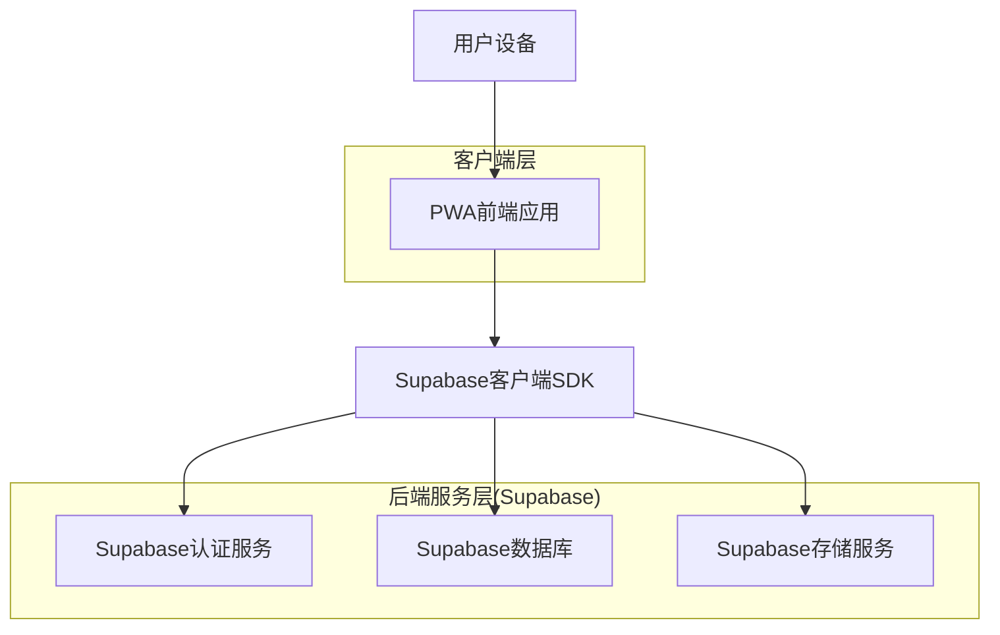
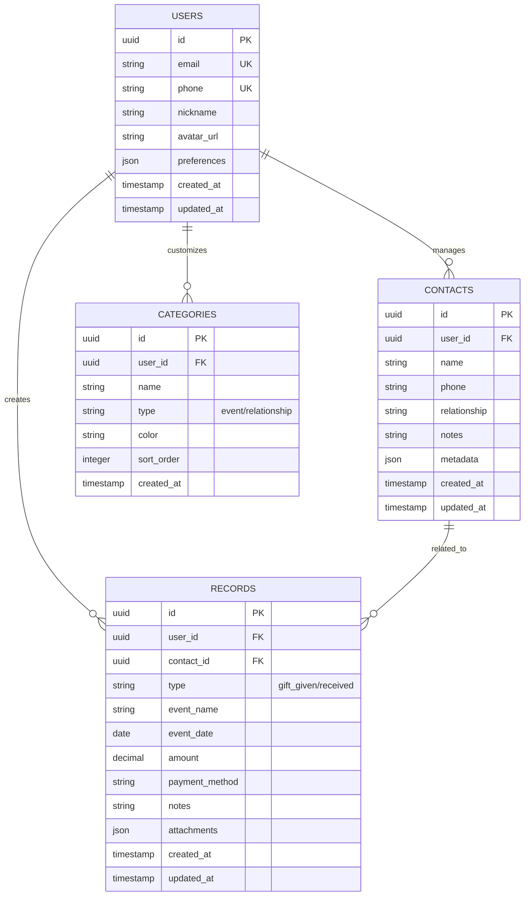

## 1. 架构设计



## 2. 技术选型

### 前端技术栈
- **框架**: React 18 + TypeScript
- **构建工具**: Vite
- **样式方案**: Tailwind CSS + 自定义组件库
- **状态管理**: React Context + useReducer
- **路由**: React Router v6
- **PWA**: Workbox + Service Worker
- **图标**: React Icons + 自定义SVG图标

### 后端服务(Supabase)
- **认证**: Supabase Auth (手机号/邮箱)
- **数据库**: PostgreSQL
- **实时功能**: Supabase Realtime
- **文件存储**: Supabase Storage
- **边缘函数**: Supabase Edge Functions (数据导出)

### 开发工具
- **包管理**: pnpm
- **代码规范**: ESLint + Prettier
- **Git hooks**: husky + lint-staged
- **移动端调试**: VConsole

## 3. 路由定义

| 路由路径 | 页面名称 | 功能描述 |
|----------|----------|----------|
| / | 首页 | 显示礼簿概览和快捷操作 |
| /login | 登录页 | 用户手机号/邮箱登录 |
| /register | 注册页 | 新用户注册 |
| /record/add | 记账页 | 添加新的礼簿记录 |
| /record/:id | 记录详情 | 查看单条记录详情 |
| /records | 礼簿列表 | 显示所有记录，支持筛选 |
| /contacts | 联系人 | 管理联系人列表 |
| /contact/:id | 联系人详情 | 查看联系人信息和往来记录 |
| /contact/add | 添加联系人 | 新建联系人 |
| /profile | 个人中心 | 用户个人信息和设置 |
| /settings | 设置页 | 应用设置和数据管理 |
| /export | 数据导出 | 导出数据到Excel |
| /import | 数据导入 | 从文件导入数据 |

## 4. 数据模型

### 4.1 数据库实体关系图



### 4.2 数据表定义

#### 用户表 (users)
```sql
CREATE TABLE users (
    id UUID PRIMARY KEY DEFAULT gen_random_uuid(),
    email VARCHAR(255) UNIQUE,
    phone VARCHAR(20) UNIQUE,
    nickname VARCHAR(100) NOT NULL,
    avatar_url TEXT,
    preferences JSONB DEFAULT '{}',
    created_at TIMESTAMP WITH TIME ZONE DEFAULT NOW(),
    updated_at TIMESTAMP WITH TIME ZONE DEFAULT NOW()
);

-- 创建索引
CREATE INDEX idx_users_email ON users(email);
CREATE INDEX idx_users_phone ON users(phone);
```

#### 联系人表 (contacts)
```sql
CREATE TABLE contacts (
    id UUID PRIMARY KEY DEFAULT gen_random_uuid(),
    user_id UUID NOT NULL REFERENCES auth.users(id) ON DELETE CASCADE,
    name VARCHAR(100) NOT NULL,
    phone VARCHAR(20),
    relationship VARCHAR(50),
    notes TEXT,
    metadata JSONB DEFAULT '{}',
    created_at TIMESTAMP WITH TIME ZONE DEFAULT NOW(),
    updated_at TIMESTAMP WITH TIME ZONE DEFAULT NOW()
);

-- 创建索引
CREATE INDEX idx_contacts_user_id ON contacts(user_id);
CREATE INDEX idx_contacts_name ON contacts(name);
```

#### 礼簿记录表 (records)
```sql
CREATE TABLE records (
    id UUID PRIMARY KEY DEFAULT gen_random_uuid(),
    user_id UUID NOT NULL REFERENCES auth.users(id) ON DELETE CASCADE,
    contact_id UUID REFERENCES contacts(id) ON DELETE SET NULL,
    type VARCHAR(20) NOT NULL CHECK (type IN ('gift_given', 'gift_received')),
    event_name VARCHAR(200) NOT NULL,
    event_date DATE NOT NULL,
    amount DECIMAL(10,2) NOT NULL CHECK (amount > 0),
    payment_method VARCHAR(50),
    notes TEXT,
    attachments JSONB DEFAULT '[]',
    created_at TIMESTAMP WITH TIME ZONE DEFAULT NOW(),
    updated_at TIMESTAMP WITH TIME ZONE DEFAULT NOW()
);

-- 创建索引
CREATE INDEX idx_records_user_id ON records(user_id);
CREATE INDEX idx_records_contact_id ON records(contact_id);
CREATE INDEX idx_records_event_date ON records(event_date);
CREATE INDEX idx_records_type ON records(type);
```

#### 分类表 (categories)
```sql
CREATE TABLE categories (
    id UUID PRIMARY KEY DEFAULT gen_random_uuid(),
    user_id UUID NOT NULL REFERENCES auth.users(id) ON DELETE CASCADE,
    name VARCHAR(100) NOT NULL,
    type VARCHAR(20) NOT NULL CHECK (type IN ('event', 'relationship')),
    color VARCHAR(7) DEFAULT '#FF6B35',
    sort_order INTEGER DEFAULT 0,
    created_at TIMESTAMP WITH TIME ZONE DEFAULT NOW()
);

-- 创建索引
CREATE INDEX idx_categories_user_id ON categories(user_id);
CREATE INDEX idx_categories_type ON categories(type);
```

### 4.3 权限设置
```sql
-- 基本访问权限（匿名用户）
GRANT SELECT ON users TO anon;
GRANT SELECT ON contacts TO anon;
GRANT SELECT ON records TO anon;
GRANT SELECT ON categories TO anon;

-- 认证用户权限
GRANT ALL PRIVILEGES ON users TO authenticated;
GRANT ALL PRIVILEGES ON contacts TO authenticated;
GRANT ALL PRIVILEGES ON records TO authenticated;
GRANT ALL PRIVILEGES ON categories TO authenticated;

-- 行级安全策略
ALTER TABLE contacts ENABLE ROW LEVEL SECURITY;
ALTER TABLE records ENABLE ROW LEVEL SECURITY;
ALTER TABLE categories ENABLE ROW LEVEL SECURITY;

-- 创建策略
CREATE POLICY "用户只能查看自己的联系人" ON contacts
    FOR ALL TO authenticated
    USING (auth.uid() = user_id);

CREATE POLICY "用户只能查看自己的记录" ON records
    FOR ALL TO authenticated
    USING (auth.uid() = user_id);

CREATE POLICY "用户只能查看自己的分类" ON categories
    FOR ALL TO authenticated
    USING (auth.uid() = user_id);
```

## 5. API接口定义

### 5.1 认证相关API

#### 手机号登录
```
POST /auth/signin-with-phone
```

请求参数：
| 参数名 | 类型 | 必填 | 描述 |
|--------|------|------|------|
| phone | string | 是 | 手机号 |
| password | string | 是 | 密码 |

响应示例：
```json
{
  "user": {
    "id": "uuid",
    "phone": "13800138000",
    "nickname": "张三",
    "avatar_url": "https://..."
  },
  "session": {
    "access_token": "eyJ...",
    "refresh_token": "eyJ...",
    "expires_in": 3600
  }
}
```

### 5.2 记录管理API

#### 创建记录
```
POST /api/records
```

请求参数：
| 参数名 | 类型 | 必填 | 描述 |
|--------|------|------|------|
| contact_id | string | 否 | 联系人ID |
| type | string | 是 | 记录类型(gift_given/gift_received) |
| event_name | string | 是 | 事件名称 |
| event_date | string | 是 | 事件日期(YYYY-MM-DD) |
| amount | number | 是 | 金额 |
| payment_method | string | 否 | 支付方式 |
| notes | string | 否 | 备注 |

#### 获取记录列表
```
GET /api/records?type=&start_date=&end_date=&contact_id=&page=&limit=
```

查询参数：
| 参数名 | 类型 | 必填 | 描述 |
|--------|------|------|------|
| type | string | 否 | 记录类型筛选 |
| start_date | string | 否 | 开始日期 |
| end_date | string | 否 | 结束日期 |
| contact_id | string | 否 | 联系人ID筛选 |
| page | number | 否 | 页码，默认1 |
| limit | number | 否 | 每页条数，默认20 |

### 5.3 数据导出API

#### 导出Excel
```
POST /api/export/excel
```

请求参数：
| 参数名 | 类型 | 必填 | 描述 |
|--------|------|------|------|
| start_date | string | 否 | 导出开始日期 |
| end_date | string | 否 | 导出结束日期 |
| type | string | 否 | 导出类型(all/given/received) |

响应：返回Excel文件下载链接

## 6. PWA配置

### 6.1 Service Worker配置
```javascript
// sw.js
const CACHE_NAME = 'gift-tracker-v1';
const urlsToCache = [
  '/',
  '/static/js/bundle.js',
  '/static/css/main.css',
  '/manifest.json'
];

self.addEventListener('install', event => {
  event.waitUntil(
    caches.open(CACHE_NAME)
      .then(cache => cache.addAll(urlsToCache))
  );
});

self.addEventListener('fetch', event => {
  event.respondWith(
    caches.match(event.request)
      .then(response => {
        if (response) {
          return response;
        }
        return fetch(event.request);
      })
  );
});
```

### 6.2 Manifest配置
```json
{
  "name": "人情份子钱记录",
  "short_name": "份子钱",
  "description": "专业的人情往来记录工具",
  "start_url": "/",
  "display": "standalone",
  "background_color": "#FAFAFA",
  "theme_color": "#FF6B35",
  "icons": [
    {
      "src": "/icons/icon-192.png",
      "sizes": "192x192",
      "type": "image/png"
    },
    {
      "src": "/icons/icon-512.png",
      "sizes": "512x512",
      "type": "image/png"
    }
  ]
}
```

## 7. 部署方案

### 7.1 前端部署
- **平台**: Vercel/Netlify
- **域名**: 配置自定义域名
- **HTTPS**: 自动SSL证书
- **CDN**: 全球加速

### 7.2 数据库备份
- **自动备份**: Supabase每日自动备份
- **手动导出**: 支持SQL导出和数据迁移
- **监控**: 数据库性能监控和告警

### 7.3 监控分析
- **性能监控**: Web Vitals指标收集
- **错误追踪**: Sentry错误监控
- **用户分析**: Google Analytics/百度统计